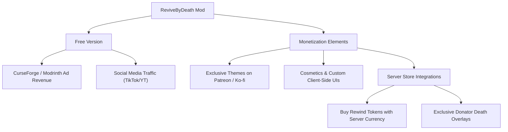

# ReviveByDeath: Viral & Monetization Strategy

ReviveByDeath possesses a strong core concept—replacing death with a dramatic, cinematic rewind sequence. This idea is highly appealing to anime fans (e.g., Re:Zero, JoJo, Sekiro), hardcore survival enthusiasts (Roguelike/Soulslike), and content creators.

Here are the best strategies to make this mod go **viral** and successfully **monetize** it.

---

## 1. Visual & Audio Upgrades (The "Viral" Factor)

TikTok, YouTube Shorts, and Instagram Reels heavily favor high-contrast, dramatic, or humorous (meme) visual clips. Enhancing the cinematic presentation is key to organic reach.

> [!NOTE]
> Currently, the transitions and particle systems are highly polished and smooth. These advanced enhancements can be saved for major content updates down the line if needed.

### A. Shaders & Post-Processing Effects
- **Time Distortion / Chromatic Aberration**: Apply glitch, VHS, or chromatic aberration overlay effects during the rewind sequence.
- **Grayscale World**: Turn the surrounding environment black and white, leaving only red soul particles or the player's glowing eyes in color.
- **Timeglass Overlay**: A subtle, semi-transparent hourglass spinning backwards in the center of the screen during rewind.

### B. Dynamic Particle Effects
- **Soul Dissolution**: When the player dies, their skin dissolves into reverse-flying particles of light leading back to the checkpoint.
- **Anime Shockwave**: Emit a shockwave burst when the rewind begins and ends.

### C. Sound Design
- **Eerie Whispers**: Add distorted, whispered voices (similar to the "Call of the Witch" from Re:Zero) or a racing heartbeat sound.
- **Reverse Audio**: Enhance the rewind sound effects with a deep bass drop and reverse-audio audio swells.

---

## 2. Resource Pack Support (Theme Customization)

Hardcoding a single overlay texture limits creative freedom. Allowing the community to customize their themes will naturally drive promotional sharing.

- **Dynamic Theme Registry**: Allow resource pack creators to define PNG frame sequences, frame rates, custom audio, and shaders via a JSON config file.
- **Preset Themes**:
  - *Dark Fantasy (Default)*: A Soulslike death screen overlay (e.g., red "DEATH REWOUND" text).
  - *Cyber Glitch*: Futuristic Matrix-like glitch text running down the screen.
  - *Meme/Comedy*: Transition overlays featuring famous memes (e.g., "GTA Wasted" or the Skyrim wagon opening).
- **Creator Collaborations**: Team up with content creators to design custom theme packs that they can showcase to their audiences.

---

## 3. Gameplay Mechanics (Attracting Servers & Hardcore Playstyles)

For multiplayer servers or hardcore survival modpacks, visual aesthetics aren't enough; balance and gameplay consequences are vital.

- **Timeline Fracture**:
  - If a player rewinds too many times within a short duration, they cause a timeline rift.
  - Generates minor weather anomalies, summons a phantom/spiritual clone of themselves (a mini-boss to defeat), or corrupts local terrain (cracking blocks).
- **Rewind Sickness**:
  - A short-term debuff after reviving (e.g., temporary health reduction, weakness, or visual distortion) to ensure players remain cautious despite having a checkpoint.
- **Ritual-Based Checkpoints**:
  - Besides beds, allow players to craft temporary shrine blocks or consume rare items to mark custom checkpoints inside dungeons.

---

## 4. Monetization Strategy

Below is a roadmap to convert the mod's popularity into actual revenue streams.

### A. Patreon/Ko-fi Exclusive Themes
- Offer the core mod completely free.
- Put high-quality, pre-made themes (e.g., high-definition Re:Zero theme, JoJo Bites the Dust theme, or custom pixel art transitions) behind a Patreon tier or Ko-fi shop.

### B. Server Store Integration
- Multiplayer servers love cosmetics. Provide API hooks so server administrators can lock certain custom overlays or revival animations behind VIP ranks.
- Tebex/Buycraft compatibility: Allow players to purchase "Rewind Tokens" or custom revival styles directly from server webstores.

### C. Meme Marketing Campaigns (TikTok & Shorts)
- Create short, engaging clips of players dying in ridiculous/unexpected ways (e.g., blown up by 50 creepers, falling into the void) transitioning into funny meme rewinds.
- Direct viewers to the CurseForge/Modrinth links to download, earning ad revenue from downloads (Creator Rewards Programs).
